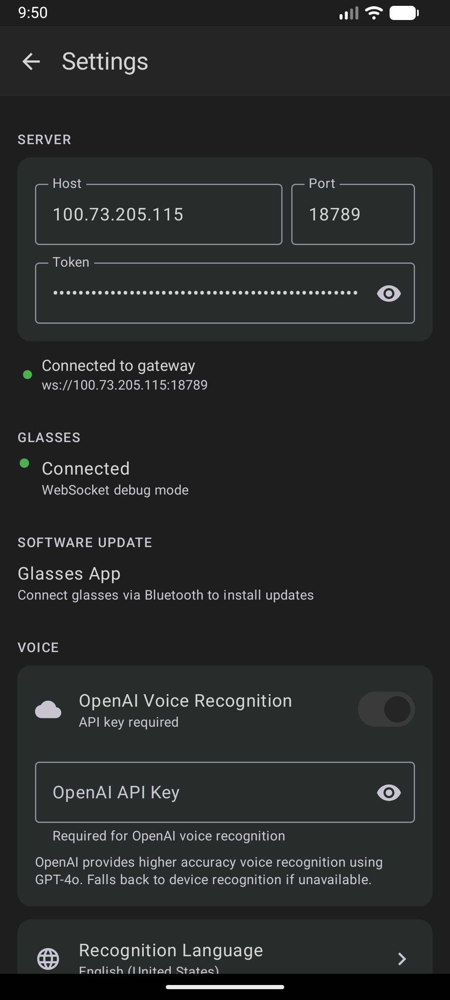

# Clawsses

Connect to your [OpenClaw](https://github.com/openclaw/openclaw) server 🦞 with your [Rokid Glasses](https://global.rokid.com/pages/rokid-glasses) 🕶️. Bring the power of OpenClaw with you anywhere you go. Give it voice command, send it photos of what you're looking at and see the answers stream in on the screens inside the glasses and hear your molty speak.

<p align="center">
  
</p>

> **Current source release:** [Clawsses 1.3.96 / Build 105](https://github.com/klabir/clawsses/releases/tag/v1.3.96). Builds 103–105 harden HUD gesture, hardware-key, lifecycle, and reconnect orchestration and add privacy-safe runtime diagnostics with soak coverage. Public releases contain source only; APKs built with Rokid credentials are private device artifacts.

<p align="center">
  
  
</p>

## What It Does

Clawsses connects your Rokid glasses to an OpenClaw Gateway, via your Android phone, giving you a wearable AI interface:

- **Voice-first interaction** - Long-press to speak, or enable persistent Talk Mode for automatic send and listen-after-reply
- **Live streaming** - AI responses stream token-by-token onto the glasses display
- **Camera input** - Send a 1280x720 photo by itself or attach it to a later message; optionally save captures to Android Gallery
- **Agent and session management** - Switch between OpenClaw agents and sessions from the phone or glasses
- **Text-to-speech** - Hear responses through ElevenLabs or OpenAI, with stop and replay controls
- **Run control** - See thinking/streaming status and cancel the exact active OpenClaw run
- **Wake-on-message** - Glasses display wakes automatically when new messages arrive
- **Deep-sleep recovery** - Detect and retry an unresponsive CXR session without deleting the Android Bluetooth bond; optional Always Ready mode trades battery life for faster availability
- **Slash commands** - Quick access to OpenClaw commands (`/model`, `/clear`, `/status`, etc.)

<p align="center">
  
  &nbsp;&nbsp;
  
  &nbsp;&nbsp;
  
</p>

## Architecture

The system is three components: a **phone app** that bridges everything, a **glasses app** that runs the HUD, and an **OpenClaw Gateway** that provides the AI backend.

```
OpenClaw Gateway ←─ WebSocket ──→ Phone App (Android) ←─ Bluetooth CXR ──→ Glasses App (Rokid)
      │                                │                                        │
  AI sessions                    Bridge + voice                          HUD + gestures
  Chat streaming                 TTS playback                           Camera capture
  Tool execution                 Wake management                        Session picker
```

### Modules

| Module | Description |
|--------|-------------|
| **phone-app/** | Android companion app. Connects to OpenClaw Gateway via WebSocket and to glasses via Rokid CXR-M SDK (Bluetooth). Handles voice recognition, TTS playback, wake signal coordination, and glasses APK sideloading. |
| **glasses-app/** | HUD app running on Rokid glasses. Renders chat UI with Jetpack Compose on the 480x640 monochrome green micro-LED display. Handles touchpad gestures and camera capture. |
| **shared/** | Protocol definitions (Gson-serialized data classes) used by both apps. |

## Setup

Intimidated by the instructions below? Ask your OpenClaw agent to help.

### Prerequisites

- [Git](https://git-scm.com/download/)
- [Android Studio](https://developer.android.com/studio)
- Rokid Glasses (or emulator - see [Emulator Testing](#emulator-testing))
- A [Rokid developer account](https://developer.rokid.com/) for CXR SDK credentials (client secret + access key)
- A running [OpenClaw](https://github.com/openclaw/openclaw) Gateway

### 1. Enable USB Debugging on Your Phone

To install and debug the app on your Android phone:

1. Go to **Settings → About Phone** and tap **Build Number** 7 times to enable Developer Options
2. Go to **Settings → Developer Options** and enable **USB Debugging**
3. Connect your phone via USB cable
4. Accept the **"Allow USB Debugging?"** prompt on your phone

### 2. SDK Credentials

Copy the ignored template and edit the resulting file in an editor:

```bash
cp local.properties.example local.properties
chmod 600 local.properties
```

Enter your Rokid CXR SDK credentials in `local.properties`:

```properties
rokid.clientSecret=your-client-secret
rokid.accessKey=your-access-key
```

These values are available only to explicitly opted-in private hardware builds. Ordinary debug and
release APKs receive empty `BuildConfig` fields even when `local.properties` contains credentials.
The paired hardware-test release enables both data-preserving debug signing and credential embedding:

```bash
./gradlew -Pclawsses.hardwareTestSigning=true :phone-app:assembleRelease
```

> `local.properties` is git-ignored, but Rokid requires these values inside the Android client.
> They therefore cannot be treated as confidential after compilation. APKs built with production
> Rokid credentials are private-device artifacts and must never be published or attached to public
> releases. Run `./gradlew :phone-app:verifyPublicReleaseHasNoRokidCredentials` in every public
> release environment. The verification task builds and scans the public APK. Rotate a credential
> immediately after suspected APK or Logcat exposure.

### 3. OpenClaw Gateway Setup

The phone app connects to your OpenClaw Gateway via WebSocket. A few things to configure:

**Set a gateway token** (used by the app to authenticate):
```bash
openclaw config set gateway.auth.token <your-token>
```

**Provide a private TLS endpoint.** This hardened client rejects `ws://` and requires `wss://`. Keep the gateway private and expose it through Tailscale Serve or another authenticated TLS reverse proxy. For OpenClaw's integrated Tailscale route:
```bash
openclaw config set gateway.tailscale.mode serve
openclaw gateway restart
```

Enter the resulting MagicDNS host in Clawsses (for example `machine.tailnet.ts.net`) and port `443`. Do not expose the raw gateway port to the public internet.

**Device approval:** The first connection from the app will fail — this is expected. OpenClaw requires you to approve new devices:

```bash
# After the first connection attempt, list pending devices
openclaw devices list

# Approve the device
openclaw devices approve <requestId>
```

After approval, the app will automatically reconnect.

### 4. Build & Install

Make sure to select the **`phone-app`** module (not `app`) in the run configuration dropdown at the top of Android Studio.

```bash
# Build both apps (glasses APK is bundled into phone app assets automatically)
./gradlew assembleDebug

# Install phone app via command line...
adb install phone-app/build/outputs/apk/debug/phone-app-debug.apk

# ...or just click the green ▶ Play button in Android Studio
```

The phone app bundles the glasses APK and can push it to the glasses over WiFi P2P - no developer cable needed.

### 5. Connect

<p align="center">
  
</p>

1. Open the phone app and configure your private WSS OpenClaw Gateway host, port, and token in Settings. A Tailscale Serve hostname normally uses port `443`.
2. The first time you connect, the gateway will reject the connection because your device isn't paired yet. On the gateway, approve the pending device:
   ```bash
   # List pending pairing requests
   openclaw devices list

   # Approve the pending request (use the requestId from the gateway logs)
   openclaw devices approve <requestId>
   ```
   After approval, the app will automatically reconnect and receive a device token for future sessions.
3. Fold the right leg, and triple click the camera button to start pairing mode on the glasses.
4. Scan for and connect to your Rokid glasses via Bluetooth
5. Use the Install to glasses button in the settings screen to load the app onto the glasses via Wifi
6. Put on the glasses and find the app in the last position of your apps screen
7. The glasses HUD will show the connection status and your current session

> **Note:** The app uses Ed25519 device identity for authentication. On first launch, it generates a keypair that uniquely identifies your device. The gateway must approve this device before allowing connections. This is the same security model used by the OpenClaw CLI and Control UI.

## Usage

### Voice Input

Long-press on the glasses temple to start voice recognition.

Two speech recognition backends are supported:
- **OpenAI Realtime API** (primary) - streaming transcription with `gpt-live-transcribe`, local speech-end detection, and audio pre-buffering for immediate capture. The final text appears after you stop speaking.
- **Android SpeechRecognizer** (fallback) - used automatically when no OpenAI API key is configured; shows speech while you talk, but recognition isn't as great.

Configure your OpenAI API key in Settings > Voice to enable the primary backend.

### Talk Mode

Enable **Settings → Voice → Talk Mode** or choose **Talk Mode** in the glasses More menu.

- **Hi Rokid-style follow-up** is the default and is activation-gated. Press the glasses AI key to start; after each
  spoken answer, Clawsses opens a 12-second follow-up window and ends the conversation
  on silence, error, standby, or disconnect.
- **Always listening** preserves the original Permanent Talk behavior. Recognition restarts while the selected
  source remains available.

In both modes recognized text is sent immediately, and the OpenClaw answer streams to
the HUD and is spoken when TTS is configured.

Press the glasses **AI key** while an answer is running to stop TTS, cancel the exact active OpenClaw run, and begin the next utterance. Disable Talk Mode with the settings toggle, the More menu, or the voice command **“stop talk mode”** / **“Talk Modus aus”**.

### Temple Touchpad Gestures

The glasses touchpad has two focus areas that change what gestures do:

| Gesture | Message History | Menu Bar |
|---------|-------------|----------|
| **Swipe forward** (→ eyes) | Scroll down | Previous menu item |
| **Swipe backward** (→ ear) | Scroll up | Next menu item |
| **Tap** | Scroll to bottom | Execute menu action |
| **Double-tap** | Jump to menu  | Exit app |
| **Long-press** | Voice input | Voice input |

### Menu Bar

| Item | Action |
|------|--------|
| 📷 Photo | Capture a photo to attach to your next message (up to 4) |
| ◎ Session | Open session picker - browse, switch, or create sessions |
| █ Size | Cycle HUD position: Full → Bottom Half → Top Half |
| … More | Talk Mode, agent selection, font size, slash commands, TTS stop/replay, and active-run cancellation |

<p align="center">
  
  &nbsp;&nbsp;
  
  &nbsp;&nbsp;
  
</p>

### Camera

Tap the Photo menu item to capture a 1280x720 image through the glasses camera. Queue up to four images for the next message, or use **Take and Send Photo** to send an image without additional text. **Settings → Glasses → Save captures to Gallery** stores an additional copy under `Pictures/Clawsses`.

The voice commands **“take photo”**, **“take and send photo”**, **“Foto aufnehmen”**, and **“Foto aufnehmen und senden”** call the same camera actions.

### Text-to-Speech

Choose ElevenLabs or OpenAI in the phone app TTS settings, then enable voice responses from the glasses More menu. OpenAI uses `gpt-4o-mini-tts` and shares the encrypted OpenAI key configured for transcription. Both providers support stop and replay controls on the phone and glasses.

### Wake-on-Message

When new content arrives (streaming responses, proactive messages, cron notifications), the phone automatically wakes the glasses display via the CXR SDK and delivers buffered messages once the glasses acknowledge readiness. A keep-alive mechanism prevents the display from sleeping during long streaming responses.

### Deep-Sleep Recovery and Always Ready

Rokid firmware can put the proprietary CXR path into deep sleep even while Android still shows the glasses as paired. Clawsses detects a connected-but-unresponsive session, runs a bounded recovery sequence, and exposes an explicit retry action instead of deleting the Bluetooth bond or retrying indefinitely.

If recovery asks you to wake the glasses, fold the right leg and triple-press the camera button to advertise the CXR beacon, then retry. **Settings → Glasses → Always Ready** keeps the display/CXR path refreshed independently of Talk Mode, but increases glasses battery use.

## Display

The Rokid AR Lite uses JBD 0.13" micro-LED displays:
- **Resolution:** 480x640 (portrait)
- **Color:** Monochrome green on transparent AR waveguide
- **Brightness:** 1500 nits
- **Font:** JetBrains Mono
- **Font sizes:** Compact / Normal / Comfortable / Large (configurable from glasses)

## Emulator Testing

You can develop without physical glasses by using the built-in debug mode. In debug builds, Bluetooth is replaced with a local WebSocket connection:

1. Create a glasses AVD: **480x640**, 5" screen
2. Run the phone emulator - it starts a WebSocket server on port 8081
3. Run the adb command as specified in the settings screen
4. Run the glasses emulator - it auto-connects to `10.0.2.2:8081`
   
```bash
# Phone app (includes glasses APK in assets)
./gradlew :phone-app:installDebug

# Glasses app
./gradlew :glasses-app:installDebug
```

## OpenClaw Protocol

The phone app implements the [OpenClaw Gateway protocol](https://docs.openclaw.ai):

- **Transport:** TLS-only `wss://`; plaintext WebSocket endpoints are rejected
- **Authentication:** Token auth + Ed25519 device identity (keypair stored in Android Keystore)
- **Chat:** Sends `chat.send`, receives streaming `chat` events with accumulated text (client diffs to extract new content)
- **Run control:** Cancels only the frozen active `sessionKey` + `runId` through `chat.abort`
- **Agents and sessions:** Lists and switches agents with `agents.list`, plus session list/switch/create/reset
- **Auto-reconnect:** 3-second backoff on disconnect

## Phone-Glasses Protocol

Communication between phone and glasses uses JSON messages over the CXR SDK bridge (or WebSocket in debug mode):

**Phone → Glasses:** `chat_message`, `agent_thinking`, `chat_stream`, `chat_stream_end`, `connection_update`, `session_list`, `agent_list`, `voice_state`, `voice_result`, `wake_signal`, `tts_state`, `run_state`, `talk_mode_state`

**Glasses → Phone:** `user_input` (text + optional photo), `list_sessions`, `switch_session`, `list_agents`, `switch_agent`, `slash_command`, `start_voice`, `cancel_voice`, `request_more_history`, `wake_ack`, `tts_toggle`, `tts_control`, `abort_run`, `talk_mode_toggle`

## Security Notes

- Runtime OpenClaw, Rokid pairing, OpenAI, and ElevenLabs settings use Android Keystore-backed encrypted preferences.
- Android backup is disabled for both apps so credentials and device identity are not copied to cloud backups.
- Logs contain connection metadata, not chat text, transcripts, device payloads, or credentials.
- Keep `local.properties` private and publish source only; production Rokid credentials are embedded in locally built phone APKs.

## Screenshots

See the full [screenshot gallery](docs/SCREENSHOTS.md) for more images of the glasses HUD and phone app.

## Troubleshooting

### "Connection refused" / app won't connect

- Verify the OpenClaw Gateway is running and the correct private TLS hostname, port, and token are entered in Settings
- Confirm the endpoint opens as `https://` and the WebSocket route is available as `wss://`
- Check that Tailscale or your VPN is connected on both the phone and gateway host
- Plaintext `ws://` / `http://` endpoints are intentionally rejected

### "Pairing required" / first connection fails

This is normal! OpenClaw requires device approval before allowing connections:

1. The first connection attempt will be rejected
2. Run `openclaw devices list` to see the pending device
3. Run `openclaw devices approve <requestId>` to approve it
4. The app will automatically reconnect

### App crashes on startup

- Ensure `local.properties` exists in the project root with valid Rokid CXR SDK credentials
- Try a clean build: **Build → Clean Project**, then **Build → Rebuild Project**

### Glasses app installation fails

- Keep the existing Android Bluetooth bond; do not unpair the glasses as the first recovery step
- Enable and foreground Hi Rokid, fold the right leg, and triple-press the camera button to advertise the CXR beacon
- Wait until Hi Rokid reports a live glasses connection, then retry installation from Clawsses
- If the integrated route still fails and the standalone Rokid CXR-L installer is available, install the exact matching glasses APK through that route

### Voice recognition not working

- Without an OpenAI API key, the app falls back to Android's built-in speech recognition
- For better results, add your OpenAI API key in **Settings → Voice**

### No audio / TTS not working

- Configure either an ElevenLabs or OpenAI API key in phone app **Settings → TTS**
- On the glasses, make sure TTS is enabled via the **More** menu (… → toggle voice responses)

## Credits

This fork is based on [dweddepohl/clawsses](https://github.com/dweddepohl/clawsses). Features were selectively reimplemented after reviewing ideas in [YNCK000/clawsses](https://github.com/YNCK000/clawsses) (photo/history and scrolling), [Steven0706/clawsses](https://github.com/Steven0706/clawsses) (TTS, agent/session UI, gallery and camera), and [Massif-5279/clawsses](https://github.com/Massif-5279/clawsses) (Talk Mode and run cancellation). The forks were not merged wholesale; security and current OpenClaw/OpenAI protocol behavior were retained independently.

## License

Copyright (C) 2026 Pohlster BV

This project is licensed under the [GNU Affero General Public License v3.0](LICENSE) (AGPL-3.0).

You are free to use, modify, and distribute this software under the terms of the AGPL-3.0. Any modified versions must also be made available under the same license.

**Commercial licensing:** If you want to use Clawsses in a commercial / closed-source product, a commercial license is available. Contact Daan Weddepohl on Linkedin.

**Third-party components:** This project uses the Rokid CXR SDK, which is proprietary and licensed separately by Rokid Corporation. It is not redistributed as part of this source code.
